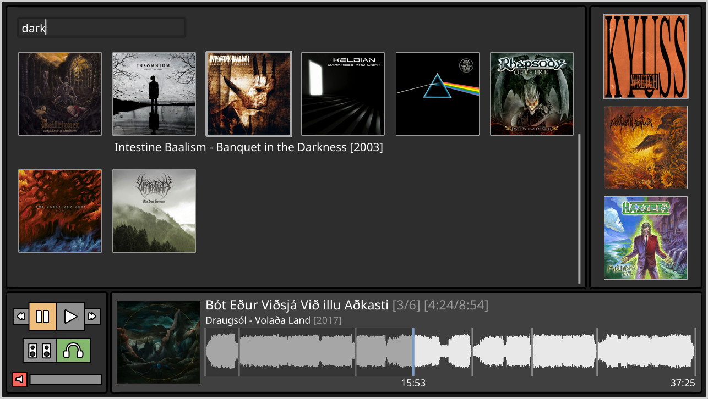

Graphical music player based on mpv



# Features

- Album-based playback
- Client-server architecture: close the player and let the music play in the background
- Waveform seekbar
- Lyrics display
- Lightweight (for some definition of it...)
- Gapless playback
- Broad format support thanks to mpv
- Dynamic output (speakers/headphones) switching
- Modular (if you write code for it :^)) graphical client
- Optionally control the server with simple shell commands
- Can be fully operated with mouse and/or keyboard
- Only requires mpv to be installed (which you already have, right?)

# FAQ

## Does this work on \<non-linux platform\>?

Probably not at the moment. The client/server uses unix domain sockets for communication, and some features might depend on pulseaudio. I also frequently rely on the fact that paths on linux can accept any character (except for `\`), which is not usually the case elsewhere.

## How does output switching work?

Using the `ao-device` option of mpv. Works well with pulseaudio, but I don't know about other sound systems.

## How can I import my library?

The client script must be configured with the directory containing the library. The library must follow a very specific pattern like so
```
LIBRARY
├── ARTIST1/
│   ├── YEAR - ALBUM1/
│   │     ├── 01 TRACK1
│   │     ├── 02 TRACK1
│   │     ...
│   ├── YEAR - ALBUM2/
│   │     ├── 01 TRACK1
│   │     ├── 02 TRACK1
│   │     ...
├── ARTIST2/
│   ├── YEAR - ALBUM1/
...
```

The server does not have any concept of library, all it receives are commands telling it to play a list of files.

## This is pretty restrictive, my library does not follow that pattern.

That's true. This could be improved by accepting a json file which describes the library. I might do that.

## Where does it get the lyrics from?

The client does not retrieve the lyrics from anywhere. They must be downloaded ahead of time and stored in a structure that mirrors that of the audio files.

## What about the waveform seekbar, is it generated automatically?

No, it's not. Similarly to the lyrics, it must be pre-generated using ffmpeg. There is a script that does it for each album in a file hierarchy.

## What about the thumbnails, surely they are?

Also not. They must be pre-rendered as well using ffmpeg so that they can be used with the overlay feature of mpv. There is also a script for that in the `contrib/` folder (TODO).

## This is all very tedious, I want my computer to serve me, not the other way around.

Understandably, but making all this stuff work dynamically requires writing a lot of code. On the other hand, my music library changes sufficiently rarely that I'm fine with just running a couple of scripts occasionally. I've also made this first and foremost for myself so I will not spend much time on features I do not need.

## How can I control the server from the commandline?

This is simply done using the IPC of mpv. The server configuration is actually very close to the default configuration of mpv, so its documentation should apply.  
https://mpv.io/manual/master/#json-ipc

This is also the way the client communicates.

## Why is the client implemented in mpv?

There is no good reason for it, and it would definitely have been simpler to do this with a proper GUI framework. On the other hand, it's kind of neat to use the same program for both the client and the server.

## How does the UI of the client work, then?

Broadly speaking, it's all rendered using the subtitles library of mpv (libass), thanks to its drawing primitives. One exception is the seekbar, which is prerendered using ffmpeg as stated previously. I find it surprisingly reponsive considering that I never really optimized it and that, well, it's just a subtitles library.

Another neat thing is that the buttons do not 'cheat' to appear more responsive: they always faithfully represent the state of the server. For example, when you click on 'play', the client sends a message to the server. The server reacts to it and broadcasts its state change to listeners (the client is one of them). The client receives the actual state change, and updates its button accordingly. Intuitively, I thought that this would be sluggish, but I cannot notice any delay.

## Can I tweak the equalizer?

Not yet, but this could be done. The server would have to use an audio filter from ffmpeg, and the client expose a UI to control it. I might add this.

## Since the client is a video player, can I have a fancy visualizer?

This is not really possible with the current architecture. Since the playback happens in a completely different process from the client, we cannot just throw an ffmpeg filter at it. Ironically, this would be easy if everything took place directly in the client.

## I want to display/edit the metadata of the files

This is not a goal, and I will not implment it.

# TODO

- Equalizer, as stated
- General styling improvements
